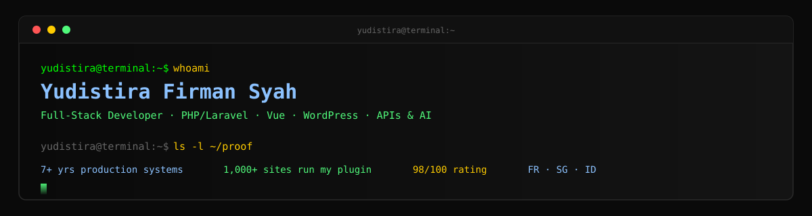

**Full-Stack Developer** · PHP/Laravel · Vue · WordPress · APIs & AI integrations

7+ years building production web systems and business automations for companies in
France, Singapore and Indonesia.

[-2ea043?style=for-the-badge&logo=adobeacrobatreader&logoColor=white)](https://yudistira-fs.my.id/cv/Yudistira-Firman-Syah-CV.pdf)

---

## What I actually ship

I'm not going to pad this with tutorial projects. Here is code I have written that other
people depend on, with the numbers to back it up.

<table>
<tr>
<td width="50%" valign="top">

### 🌍 Linguise - WordPress Plugin
**Used on 1,000+ live websites**

I build and maintain the WordPress integration for Linguise, an AI automatic-translation
service. I own the plugin core, the API communication with the translation service, the
settings dashboard and the front-end language switcher.

[→ View on WordPress.org](https://wordpress.org/plugins/linguise/)

</td>
<td width="50%" valign="top">

### 🤖 WP AI Assistant
**Commercial AI product**

A WordPress plugin that turns a site into a 24/7 AI support and lead-generation engine. It
reads the site's own content, answers visitor questions in a chat widget and captures leads
from those conversations.

[→ View product page](https://www.joomunited.com/wordpress-products/wp-ai-assistant)

</td>
</tr>
</table>

---

## Production systems I've run

<table>
<tr>
<td width="33%" valign="top">

**CITY Electronique**
Sole developer · 2+ years

French electronics company. Rebuilt their platform on Laravel + Vue with a GitHub Actions
CI/CD pipeline, integrated Zoho CRM via API, automated their sales flow, built and shipped
their production AI chatbot - all as the only developer on it.

`Laravel` `Vue` `Zoho CRM` `CI/CD` `AI chatbot`

</td>
<td width="33%" valign="top">

**Canggu Ink Club**
Delivered in under 2 months

A premium Bali tattoo studio needed a booking system no off-the-shelf product could handle.
Built one with the CEO directly: multi-artist bookings, per-artist pricing and commission
rules, deposits, and group payments where one person pays for friends.

`Zoho Creator` `Deluge` `WordPress`

</td>
<td width="33%" valign="top">

**The Edge Singapore**
High-traffic property news platform

Maintained the Drupal CMS behind one of Singapore's leading property platforms, keeping
daily operations stable, and wrote a custom module that imports and processes offline sales
data into the database - replacing a manual process.

`Drupal` `PHP` `Custom modules`

</td>
</tr>
</table>

Also: **Gameloft** (internal data platform for the Indonesian branch) · **Viagoo.co** (fleet & logistics SaaS across Asia) · **PT Anugerah Cipta Kreatif** (APIs behind a local-commerce mobile app) · **PT Onklas Prima Indonesia** (education platform APIs)

---

## How I work

I work **directly with stakeholders** and I'm comfortable being the only developer on a
project - that's been the situation for my two current engagements. My favourite problems
are the ones sitting between systems: a CRM that can't talk to a website, a booking flow
that no product models correctly, a manual process that costs someone hours a week.

I use **AI coding agents daily** as part of how I build, and I integrate LLMs into products
properly - the chatbot at CITY Electronique and WP AI Assistant are both in production, not
demos. I care more about picking the right tool for the problem than about defending a
favourite stack.

**I'll name what I'm not:** my deepest production experience is PHP/Laravel, Vue and
WordPress. I have used Docker and Linux throughout, Kubernetes only at the level of deploying
and operating containerized services (not cluster administration), and Python for scripting
rather than production backends. Tools can be learned - I'd rather be straight with you about
where the line is.

---

## Toolbox

**Languages & Frameworks**

**CMS & E-commerce**

**Automation & AI**

**Data & Infrastructure**

---

**Open to remote work, relocation and visa sponsorship.**
Bali, Indonesia (UTC+8) - strong overlap with APAC, morning overlap with Europe.

**[Portfolio](https://yudistira-fs.my.id)** · **[Download CV](https://yudistira-fs.my.id/cv/Yudistira-Firman-Syah-CV.pdf)** · **[Email me](mailto:firmansyah8786@gmail.com)** · **[LinkedIn](https://www.linkedin.com/in/yudistira-firman-syah-29b456193)**

Everything here is verifiable - the plugin numbers come live from the WordPress.org API, and the CV and portfolio are public links.

